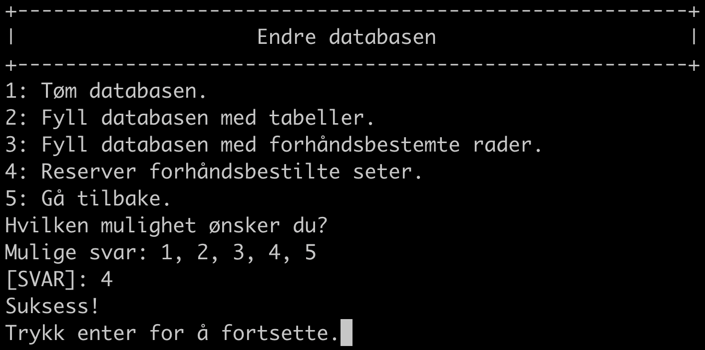
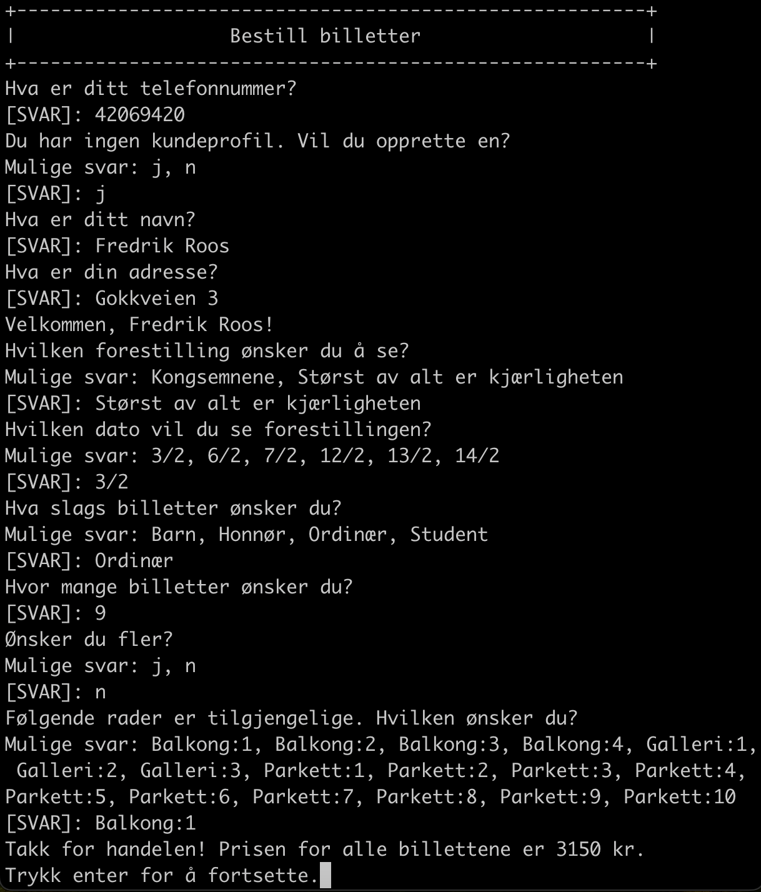
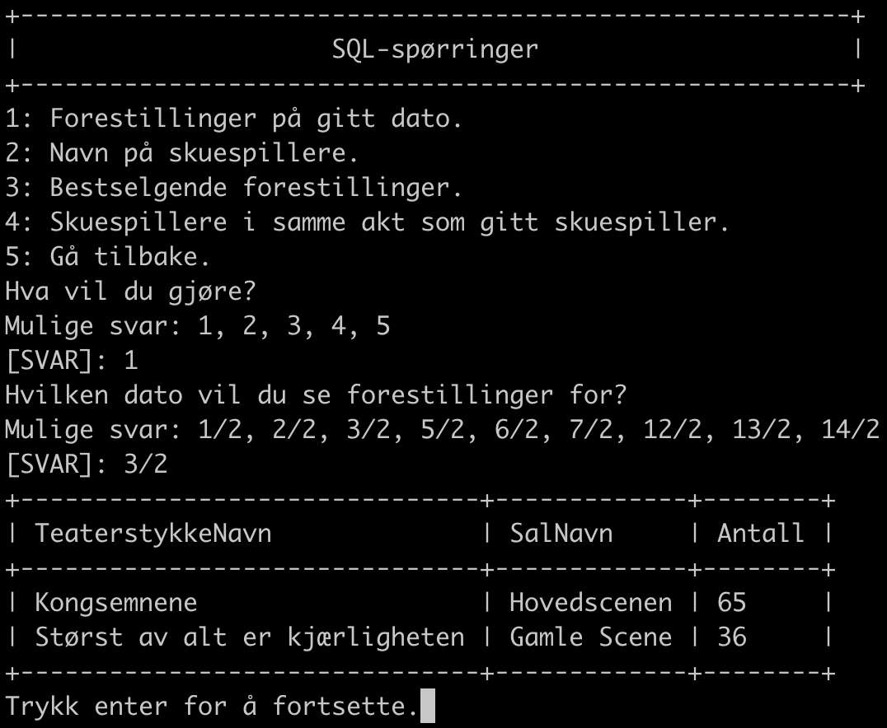
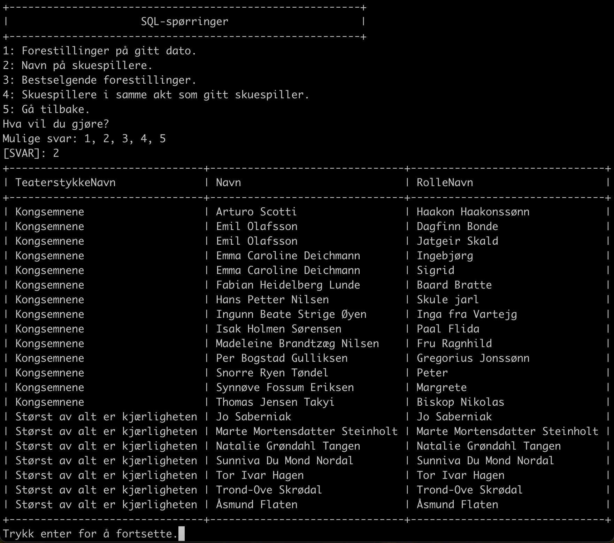
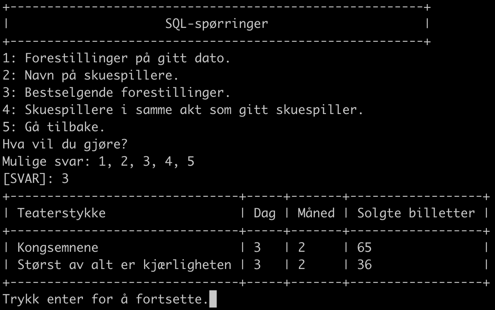
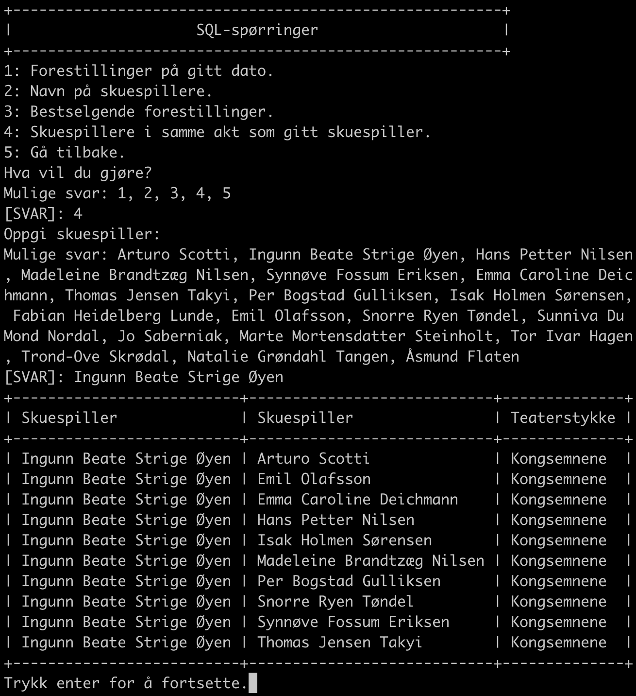

> Skrevet av: Andreas Kolstad Bertelsen, Robin Rienks Hestad, Fredrik Oldeide Roos, og Aleksander Thornes Vestlund.

# Databaseprosjekt

## Table of contents

- [Krav til kjøring](#krav-til-kjøring)
- [Starting av applikasjonen](#starting-av-applikasjonen)
- [Valgmuligheter](#valgmuligheter)
  - [Endre database](#endre-database)
  - [Bestill billetter](#bestill-billetter)
  - [SQL-spørringer](#sql-spørringer)
- [Brukerhistorier](#brukerhistorier)

## Krav til kjøring

Sørg for at du har lastet ned:

- Python >=3.10.

## Starting av applikasjonen

```bash
$ python main.py
```

## Valgmuligheter

Du kommer til å få tre valg, i tillegg til å avslutte applikasjonen.

- `1: Endre database`.
- `2: Bestill billetter`.
- `3: SQL-spørringer`.

### Endre database

Dersom du velger dette alternativet, får du fire nye valg.

- `1: Tøm databasen`. Dette alternativet sletter alle rader og tabeller fra databasen.
- `2: Fyll databasen med tabeller`. Dette alternativet leser `schema.sql`-filen og lager de forskjellige tabellene, som er ekvivalent med `sqlite3 teater.db < schema.sql`.
- `3: Fyll databasen med forhåndsbestemte rader`. Dette alternativet legger til alle forhåndsdefinerte rader beskrevet i prosjektbeskrivelsen. Her kreves det at `2: Fyll databasen med tabeller` har blitt gjennomført.
- `4: Reserver forhåndsbestilte seter`. Dette alternativet leser `hovedscenen.txt` og `gamle-scene.txt` for å reservere setene bestemt der. Her kreves det at både `2: Fyll databasen med tabeller` og `3: Fyll databasen med forhåndsbestemte rader` har blitt gjennomført.

### Bestill billetter

Her får du muligheten til å bestille billetter, der alle setene er på samme rad. Denne viser også prisen på bestillingen.

- For å finne alle rader med nok ledige seter, blir den følgende spørringen kjørt, der spørsmålstegnene blir erstattet av attributtene fra den brukerbestemte forestillingen. Dette krever at `2: Fyll databasen med tabeller`, `3: Fyll databasen med forhåndsbestemte rader`, og `4: Reserver forhåndsbestilte seter` har blitt kjørt på forhånd.

```sql
SELECT Område, RadNummer
FROM Stol AS S1
WHERE SalNavn = ? AND (RadNummer, Område, Nummer) NOT IN (
    SELECT S2.RadNummer, S2.Område, S2.Nummer
    FROM Stol AS S2
        INNER JOIN Billett
            ON S2.Nummer = StolNummer
                AND S2.RadNummer = Billett.RadNummer
                AND S2.Område = Billett.Område
        INNER JOIN Billettkjøp
            ON (BillettkjøpID = ID)
    WHERE S2.Salnavn = S1.SalNavn
        AND Billettkjøp.TeaterstykkeNavn = ?
        AND DagVises = ?
        AND MånedVises = ?
)
GROUP BY RadNummer, Område
HAVING COUNT(Nummer) >= ?
ORDER BY Område ASC, RadNummer ASC;
```

- For å finne setenumrene som finnes på den brukerbestemte raden, blir den følgende spørringen kjørt.

```sql
SELECT Nummer
FROM Stol AS S1
WHERE SalNavn = ?
    AND Område = ?
    AND RadNummer = ?
    AND (RadNummer, Område, Nummer) NOT IN (
        SELECT S2.RadNummer, S2.Område, S2.Nummer
        FROM Stol AS S2
            INNER JOIN Billett
                ON S2.Nummer = StolNummer
                    AND S2.RadNummer = Billett.RadNummer
                    AND S2.Område = Billett.Område
            INNER JOIN Billettkjøp
                ON BillettkjøpID = ID
        WHERE S2.Salnavn = S1.SalNavn
            AND S2.Område = S1.Område
            AND S2.RadNummer = S1.RadNummer
            AND Billettkjøp.TeaterstykkeNavn = ?
            AND DagVises = ?
            AND MånedVises = ?
    )
LIMIT ?;
```

### SQL-spørringer

Dersom du velger dette alternativet, får du fire nye valg. Alle disse krever at `2: Fyll databasen med tabeller` og `3: Fyll databasen med forhåndsbestemte rader` har blitt kjørt på forhånd.

- `1: Forestillinger på gitt dato`. Dette alternativet viser alle forestillinger på en brukerbestemt dato. Spørringen som blir kjørt ved å velge dette alternativet er som følger, der spørsmålstegnene blir ersattet av den brukerbestemte datoen.

```sql
SELECT Forestilling.TeaterstykkeNavn, Forestilling.SalNavn, COUNT(Billett.BillettkjøpID)
FROM Forestilling
    LEFT OUTER JOIN Billettkjøp
        ON Forestilling.TeaterstykkeNavn = Billettkjøp.TeaterstykkeNavn
            AND Forestilling.SalNavn = Billettkjøp.SalNavn
            AND Forestilling.DagVises = Billettkjøp.DagVises
            AND Forestilling.MånedVises = Billettkjøp.MånedVises
    LEFT OUTER JOIN Billett
        ON Billettkjøp.ID = Billett.BillettkjøpID
WHERE Forestilling.DagVises = ? AND Forestilling.MånedVises = ?
GROUP BY Forestilling.TeaterstykkeNavn, Forestilling.SalNavn
ORDER BY Forestilling.TeaterstykkeNavn ASC;
```

- `2: Navn på skuespillere`. Dette alternativet finner alle navn på alle skuespillere og hvilke roller disse spiller. Spørringen som blir kjørt ved å velge dette alternativet er som følger.

```sql
SELECT Akt.TeaterstykkeNavn, Skuespiller.Navn, SpillerRolle.RolleNavn
FROM Akt
    INNER JOIN DeltarI
        ON Akt.Nummer = DeltarI.AktNummer
            AND Akt.TeaterstykkeNavn = DeltarI.TeaterstykkeNavn
    INNER JOIN SpillerRolle
        USING (RolleNavn)
    INNER JOIN Skuespiller
        ON SpillerRolle.SkuespillerID = Skuespiller.ID
GROUP BY SpillerRolle.RolleNavn
ORDER BY Akt.TeaterstykkeNavn ASC, Skuespiller.Navn ASC, SpillerRolle.RolleNavn ASC;
```

- `3: Bestselgende forestillinger`. Dette alternativet finner de bestselgende forestillingene og viser hvor mange billetter som har blitt solgt til disse. Spørringen som blir kjørt ved å velge dette alternativet er som følger.

```sql
SELECT Forestilling.TeaterstykkeNavn, Forestilling.DagVises,
    Forestilling.MånedVises, COUNT(Billett.BillettkjøpID) AS Antall
FROM Forestilling
    INNER JOIN Billettkjøp
        ON Forestilling.TeaterstykkeNavn = Billettkjøp.TeaterstykkeNavn
            AND Forestilling.SalNavn = Billettkjøp.SalNavn
            AND Forestilling.DagVises = Billettkjøp.DagVises
            AND Forestilling.MånedVises = Billettkjøp.MånedVises
    INNER JOIN Billett
        ON Billettkjøp.ID = Billett.BillettkjøpID
GROUP BY Forestilling.TeaterstykkeNavn, Forestilling.DagVises, Forestilling.MånedVises
ORDER BY Antall DESC, Forestilling.MånedVises ASC,
    Forestilling.TeaterstykkeNavn ASC, Forestilling.DagVises ASC;
```

- `4: Skuespillere i samme akt som gitt skuespiller`. Dette alternativet finner alle skuespillere som har spilt i samme akt som en brukerbestemt skuespiller. Spørringen som blir kjørt ved å velge dette alternativet er som følger, der spørsmålstegnene blir ersattet av det brukerbestemte navnet.

```sql
SELECT S1.Navn, S2.Navn, DI1.TeaterstykkeNavn
FROM Skuespiller AS S1
    CROSS JOIN Skuespiller AS S2
    INNER JOIN SpillerRolle AS SR1
        ON S1.ID = SR1.SkuespillerID
    INNER JOIN SpillerRolle AS SR2
        ON S2.ID = SR2.SkuespillerID
    INNER JOIN DeltarI AS DI1
        ON SR1.RolleNavn = DI1.RolleNavn
    INNER JOIN DeltarI AS DI2
        ON SR2.RolleNavn = DI2.RolleNavn
WHERE S1.Navn = ?
    AND S1.Navn <> S2.Navn
    AND DI1.TeaterstykkeNavn = DI2.TeaterstykkeNavn
    AND DI1.AktNummer = DI2.AktNummer
GROUP BY S1.Navn, S2.Navn
ORDER BY S2.Navn ASC, DI1.TeaterstykkeNavn ASC;
```

## Brukerhistorier

- `Sette inn alle rader`.

  

- `Sette inn forhåndsbestillinger`.

  

- `Kjøpe billetter`.

  

- `Forestilling på dato`.

  

- `Navn på skuespillere`. Her ble _Ingunn Beate Strige Øyen_ vilkårlig valgt som skuespiller, som ikke spiller i samme akt som _Fabian Heidelberg Lunde_.

  

- `Bestselgende forestillinger`. Her er det verdt å nevne at det er solgt 36 billetter til _Størst av alt er kjærligheten_, hvorav 27 er forhåndsbestillinger og 9 er fra tidligere brukerhistorie.

  

- `Skuespillere i samme akt`.

  
